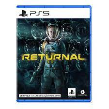

<!DOCTYPE html>
<html lang="pt-br">
<head>
    <meta charset="UTF-8">
    <meta http-equiv="X-UA-Compatible" content="IE=edge">
    <meta name="viewport" content="width=device-width, initial-scale=1.0">
    <link rel="stylesheet" href="./style/main.css">

    

    <!--Responsividade-->

    <link rel="stylesheet" href="style/responsive.css">
    
    <!-- Owl css-->
        
    <link rel="stylesheet" href="style/owl/owl.carousel.min.css">
    <link rel="stylesheet" href="style/owl/owl.theme.default.min.css">

    <title>NetFlix Clone</title>
    
</head>

<body>
    <header>
        <di class="container">
            <h2 class="logo">PLAYFLIX</h2>
            <nav>
                <a href="index.html">Home</a>
                <a href="#">Lançamentos</a>
                <a href="#">Play 4</a>
                <a href="#">Play 5</a>
                <a href="#">Playstation VR</a>
            </nav>
        </di>
    </header>

    <main>
        

            

                <h3 class="titulo">PLAYSTATION 5</h3>
                
veja a lista de games confirmados até o momento!!!

                
Hoje o destaque fica por conta do Homem-Aranha

           
                

                    <a href="capa.html"> 
                    <button role="button" class="botao"><i class="fas fa-info-circle"></i>Mais Informações</button>
                    </a> 
                

            

        

    </main>

    

        

            

                
            

            

                
            

            

                
            

            

                
            

            

                
            

            

                
            

            

                
            

            

                
            

            

                
            

            

                
            

            

                
            
            
        

    

    
    
    
    
</body>
</html>
